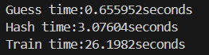
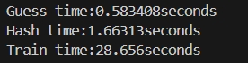
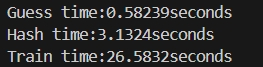
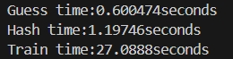

***不同并行度****的数据真实性证明，截图的是****最有利于提高SIMD加速比****的一组数据。*

***

### -no optimization -O2：

2.95719 2.97881 2.93737 3.07604 2.9881

***

### SIMD*4 -O2：

1.68335 1.67164 1.66344 1.68123 1.66313

***

### SIMD*2 -O2：

3.14893 3.15891 3.13497 3.1324 3.13298

***

### SIMD*8 (-) -O2：

1.20376 1.19794 1.20582 1.2002 1.19746

***

### SIMD*8 (+) -O2：

1.18629 1.18236 1.18812 1.1833 1.18762 1.18942
