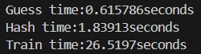
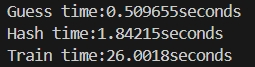
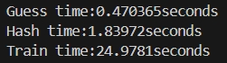
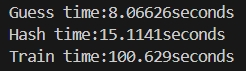
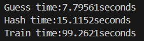
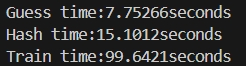

## 编译选项对加速比的影响
*只选择最有利于提高加速比的结果展示*
***
### O2

见 [speedup min data.md](https://github.com/bugp3ssy666/parallel_lab_0974/tree/main/%5BPROJECT%5D%20PCFG%20Password%20Guessing/data%20repo/guessing%20min%20data/speedup%20min%20data.md)

### O1

serial:

pthread:

openmp:

### O0

serial:

pthread:

openmp:

